# 🏗️ Arquitetura do Sistema de Investimentos

## 📋 Visão Geral

O **Sistema de Investimentos** é uma aplicação **monolítica completa** desenvolvida em **Node.js** que integra frontend e backend em uma única aplicação. O sistema simula uma plataforma de investimentos educacional com interface web moderna, permitindo que usuários gerenciem suas carteiras de investimento através de uma interface visual intuitiva ou através da API REST.

## 🎯 Objetivos Educacionais

Este projeto foi desenvolvido como material didático para demonstrar:

- **Arquitetura Monolítica Completa**: Frontend e backend em uma única aplicação
- **Interface Web Moderna**: Frontend responsivo com Bootstrap e componentes interativos
- **API RESTful**: Endpoints bem estruturados seguindo padrões REST
- **Autenticação JWT**: Sistema de segurança baseado em tokens
- **ORM Sequelize**: Abstração de banco de dados com relacionamentos
- **Validação de Dados**: Validação robusta de entrada de dados
- **Documentação Swagger**: API autodocumentada
- **Containerização**: Aplicação totalmente dockerizada
- **Transações ACID**: Operações financeiras seguras
- **UX/UI Moderna**: Interface amigável com gráficos e dashboards

## 🏛️ Arquitetura de Alto Nível

```mermaid
graph TB
    subgraph "Cliente"
        BROWSER[🌐 Navegador Web]
        MOBILE[📱 App Mobile]
        API_CLIENT[🔧 Cliente API]
    end
    
    subgraph "Monólito - Aplicação Node.js"
        APP[🚀 Express Server]
        
        subgraph "Frontend - Views"
            LAYOUTS[📄 Layouts EJS]
            PAGES[📄 Páginas]
            STATIC[📁 Assets Estáticos]
            subgraph "Páginas HTML"
                HOME[🏠 Home]
                LOGIN[🔐 Login]
                REGISTER[📝 Cadastro]
                DASHBOARD[📊 Dashboard]
                ASSETS[💰 Ativos]
                PORTFOLIO[💼 Portfólio]
                TRANSACTIONS[💸 Transações]
                PROFILE[👤 Perfil]
            end
        end
        
        subgraph "Backend - API"
            subgraph "Middleware"
                AUTH[🔐 Autenticação JWT]
                OPTIONAL_AUTH[🔓 Auth Opcional]
                VALID[✅ Validação]
                RATE[⏱️ Rate Limiting]
                ERROR[❌ Error Handler]
            end
            
            subgraph "Rotas"
                PAGE_R[📄 Page Routes]
                AUTH_R[🔑 Auth Routes]
                USER_R[👤 User Routes]
                ASSET_R[📈 Asset Routes]
                PORT_R[💼 Portfolio Routes]
                TRANS_R[💰 Transaction Routes]
            end
            
            subgraph "Modelos"
                USER_M[👤 User Model]
                ASSET_M[📊 Asset Model]
                PORT_M[💼 Portfolio Model]
                TRANS_M[💸 Transaction Model]
                PA_M[🔗 PortfolioAsset Model]
            end
            
            subgraph "Banco de Dados"
                ORM[🗃️ Sequelize ORM]
            end
        end
        
        subgraph "Documentação"
            SWAGGER[📚 Swagger UI]
            HEALTH[❤️ Health Check]
        end
    end
    
    subgraph "Infraestrutura"
        POSTGRES[(🐘 PostgreSQL)]
        REDIS[(🔴 Redis Cache)]
        DOCKER[🐳 Docker Containers]
    end
    
    subgraph "Ferramentas de Desenvolvimento"
        ADMINER[🔍 Adminer DB Admin]
        LOGS[📝 Morgan Logs]
    end
    
    BROWSER --> APP
    MOBILE --> APP
    API_CLIENT --> APP
    
    APP --> LAYOUTS
    APP --> PAGES
    APP --> STATIC
    APP --> SWAGGER
    APP --> HEALTH
    
    LAYOUTS --> HOME
    LAYOUTS --> LOGIN
    LAYOUTS --> REGISTER
    LAYOUTS --> DASHBOARD
    LAYOUTS --> ASSETS
    LAYOUTS --> PORTFOLIO
    LAYOUTS --> TRANSACTIONS
    LAYOUTS --> PROFILE
    
    APP --> AUTH
    APP --> OPTIONAL_AUTH
    APP --> VALID
    APP --> RATE
    APP --> ERROR
    
    AUTH --> AUTH_R
    AUTH --> USER_R
    AUTH --> ASSET_R
    AUTH --> PORT_R
    AUTH --> TRANS_R
    OPTIONAL_AUTH --> PAGE_R
    
    PAGE_R --> USER_M
    AUTH_R --> USER_M
    USER_R --> USER_M
    ASSET_R --> ASSET_M
    PORT_R --> PORT_M
    PORT_R --> PA_M
    TRANS_R --> TRANS_M
    
    USER_M --> ORM
    ASSET_M --> ORM
    PORT_M --> ORM
    TRANS_M --> ORM
    PA_M --> ORM
    
    ORM --> POSTGRES
    APP --> REDIS
    
    POSTGRES --> DOCKER
    REDIS --> DOCKER
    APP --> DOCKER
    
    POSTGRES --> ADMINER
    APP --> LOGS
```



## 🗂️ Estrutura de Diretórios

```
sistema-investimentos/
├── 📁 src/                          # Código fonte da aplicação
│   ├── 📁 config/                   # Configurações
│   │   └── 📄 database.js           # Configuração do Sequelize
│   ├── 📁 controllers/              # Controladores (futuro)
│   ├── 📁 middleware/               # Middlewares customizados
│   │   ├── 📄 auth.js              # Autenticação JWT
│   │   └── 📄 errorHandler.js      # Tratamento de erros
│   ├── 📁 models/                   # Modelos do Sequelize
│   │   ├── 📄 index.js             # Configuração dos modelos
│   │   ├── 📄 User.js              # Modelo de usuário
│   │   ├── 📄 Asset.js             # Modelo de ativo
│   │   ├── 📄 Portfolio.js         # Modelo de portfólio
│   │   ├── 📄 Transaction.js       # Modelo de transação
│   │   └── 📄 PortfolioAsset.js    # Modelo de relacionamento
│   ├── 📁 routes/                   # Rotas da aplicação
│   │   ├── 📄 pageRoutes.js        # Rotas das páginas (frontend)
│   │   ├── 📄 authRoutes.js        # Rotas de autenticação (API)
│   │   ├── 📄 userRoutes.js        # Rotas de usuário (API)
│   │   ├── 📄 assetRoutes.js       # Rotas de ativos (API)
│   │   ├── 📄 portfolioRoutes.js   # Rotas de portfólio (API)
│   │   └── 📄 transactionRoutes.js # Rotas de transações (API)
│   ├── 📁 views/                    # Templates do frontend
│   │   ├── 📁 layout/              # Layouts base
│   │   │   └── 📄 base.ejs         # Layout principal com navbar/footer
│   │   ├── 📁 pages/               # Páginas da aplicação
│   │   │   ├── 📄 home.ejs         # Página inicial
│   │   │   ├── 📄 login.ejs        # Página de login
│   │   │   ├── 📄 register.ejs     # Página de cadastro
│   │   │   ├── 📄 dashboard.ejs    # Dashboard principal
│   │   │   ├── 📄 assets.ejs       # Catálogo de ativos
│   │   │   ├── 📄 portfolio.ejs    # Portfólio do usuário
│   │   │   ├── 📄 transactions.ejs # Histórico de transações
│   │   │   └── 📄 profile.ejs      # Perfil do usuário
│   │   └── 📄 error.ejs            # Página de erro 404
│   ├── 📁 public/                   # Assets estáticos
│   │   ├── 📁 css/                 # Estilos CSS
│   │   │   └── 📄 app.css          # CSS personalizado da aplicação
│   │   ├── 📁 js/                  # JavaScript frontend
│   │   │   └── 📄 app.js           # JavaScript principal da aplicação
│   │   └── 📁 images/              # Imagens e ícones
│   ├── 📁 services/                 # Serviços de negócio (futuro)
│   ├── 📁 utils/                    # Utilitários
│   └── 📄 app.js                    # Arquivo principal da aplicação
├── 📁 docs/                         # Documentação
│   ├── 📄 arquitetura-sistema.md    # Este arquivo
│   ├── 📄 diagramas-sequencia.md    # Diagramas de sequência
│   ├── 📄 modelo-dados.md           # Modelo de dados
│   └── 📄 guia-uso.md              # Guia de uso da API
├── 📁 sql/                          # Scripts SQL
│   └── 📄 init.sql                  # Dados iniciais
├── 📄 docker-compose.yml            # Orquestração dos containers
├── 📄 Dockerfile                    # Imagem da aplicação
├── 📄 package.json                  # Dependências e scripts
├── 📄 config.example                # Exemplo de configuração
└── 📄 README.md                     # Documentação principal
```

## 🔧 Componentes Principais

### 1. **Express Server** (`src/app.js`)
- **Responsabilidade**: Servidor HTTP principal que serve tanto frontend quanto API
- **Funcionalidades**:
  - Configuração de middlewares de segurança (Helmet, CORS)
  - Rate limiting para prevenção de ataques
  - Documentação automática com Swagger
  - Health check endpoint
  - Graceful shutdown
  - Renderização de páginas EJS
  - Servir arquivos estáticos (CSS, JS, imagens)

### 2. **Frontend** (`src/views/`, `src/public/`)
- **Template Engine**: EJS para renderização server-side
- **CSS Framework**: Bootstrap 5 para design responsivo
- **JavaScript**: Vanilla JS com classes ES6 e fetch API
- **Funcionalidades**:
  - Layout responsivo com navegação dinâmica
  - Autenticação visual com JWT
  - Dashboard com gráficos Chart.js
  - Formulários com validação client-side
  - Notificações toast em tempo real
  - Modals para ações rápidas

### 3. **Rotas de Páginas** (`src/routes/pageRoutes.js`)
- **Responsabilidade**: Servir páginas HTML para usuários
- **Middleware**: `optionalAuth` para autenticação opcional
- **Páginas**:
  - `/` - Home com overview do sistema
  - `/login` - Autenticação de usuários
  - `/register` - Cadastro de novos usuários
  - `/dashboard` - Dashboard principal (protegido)
  - `/assets` - Catálogo de ativos para investir
  - `/portfolio` - Análise do portfólio pessoal
  - `/transactions` - Histórico de transações
  - `/profile` - Configurações do perfil

### 4. **Modelos de Dados** (`src/models/`)
- **User**: Gerenciamento de usuários e autenticação
- **Asset**: Catálogo de ativos disponíveis para investimento
- **Portfolio**: Carteira individual de cada usuário
- **Transaction**: Histórico de compras e vendas
- **PortfolioAsset**: Posições específicas de ativos no portfólio

### 5. **Sistema de Autenticação** (`src/middleware/auth.js`)
- **JWT (JSON Web Tokens)**: Autenticação stateless
- **Bcrypt**: Hash seguro de senhas
- **Middleware de proteção**: Validação automática de rotas protegidas
- **Middleware opcional**: `optionalAuth` para páginas que funcionam com/sem login

### 6. **API RESTful** (`src/routes/`)
- **Base Path**: `/api/v1/` para todas as rotas da API
- **Endpoints padronizados**: Seguindo convenções REST
- **Validação de entrada**: Express-validator para validação robusta
- **Respostas estruturadas**: Formato consistente de retorno

## 🎨 Frontend - Interface do Usuário

### Características da Interface

1. **Design Responsivo**
   - Bootstrap 5 com grid system
   - Mobile-first design
   - Compatibilidade cross-browser

2. **Navegação Intuitiva**
   - Navbar fixo com links principais
   - Sidebar para navegação secundária
   - Breadcrumbs para orientação

3. **Dashboard Interativo**
   - Widgets de resumo com métricas
   - Gráficos Chart.js para visualização
   - Tabelas com filtros e paginação

4. **Componentes Modernos**
   - Modals para ações rápidas
   - Tooltips informativos
   - Badges e indicadores visuais
   - Loading states e skeleton screens

### JavaScript Frontend

1. **Classe InvestmentApp** (`src/public/js/app.js`)
   - Gerenciamento centralizado da aplicação
   - Sistema de notificações
   - Autenticação JWT no frontend
   - Utilitários para API calls

2. **Funcionalidades**
   - Login/logout automático
   - Validação de formulários
   - Máscaras de entrada (CPF, telefone)
   - Formatação de valores monetários
   - Gráficos interativos

## 🛡️ Segurança

### Medidas Implementadas

1. **Autenticação JWT**
   - Tokens com expiração configurável
   - Verificação automática em rotas protegidas
   - Storage seguro no localStorage
   - Logout automático na expiração

2. **Validação de Dados**
   - Sanitização de entrada
   - Validação de tipos e formatos
   - Prevenção de XSS e CSRF
   - Validação client-side e server-side

3. **Rate Limiting**
   - Limite de requisições por IP
   - Proteção contra ataques de força bruta
   - Configurável por ambiente

4. **Middlewares de Segurança**
   - Helmet para headers de segurança
   - CORS configurado adequadamente
   - Content Security Policy
   - Logs de auditoria

## 📊 Banco de Dados

### PostgreSQL
- **Escolha**: Banco relacional robusto e confiável
- **Características**:
  - ACID compliance para transações financeiras
  - Suporte a JSON para dados flexíveis
  - Índices para performance
  - Backup e recuperação

### ORM Sequelize
- **Abstração**: Interface orientada a objetos
- **Migrações**: Controle de versão do schema
- **Validações**: Validação a nível de modelo
- **Relacionamentos**: Associações complexas entre entidades

## 🐳 Containerização

### Docker Compose
```yaml
services:
  app:        # Aplicação Node.js (Frontend + Backend)
  postgres:   # Banco de dados
  adminer:    # Interface administrativa
```

### Benefícios
- **Isolamento**: Ambiente consistente
- **Portabilidade**: Execução em qualquer ambiente
- **Escalabilidade**: Fácil replicação de instâncias
- **Desenvolvimento**: Setup rápido para novos desenvolvedores

## 📈 Performance

### Otimizações Implementadas

1. **Frontend**
   - CSS e JS minificados
   - Lazy loading de imagens
   - Cache de assets estáticos
   - Componentes reutilizáveis

2. **Backend**
   - Índices de banco otimizados
   - Pool de conexões configurado
   - Cache de sessões
   - Compressão gzip

3. **UX/UI**
   - Loading states visuais
   - Feedback imediato de ações
   - Validação em tempo real
   - Navegação fluida SPA-like

## 🔄 Fluxos Principais

### 1. Acesso ao Sistema
```
Usuário → Home Page → Login/Register → Dashboard → Funcionalidades
```

### 2. Navegação com Autenticação
```
Página → Verificar Token → Mostrar/Esconder Elementos → Carregar Dados
```

### 3. Operação de Investimento
```
Usuário → Assets Page → Selecionar Ativo → Modal → Confirmar → API Call → Update UI
```

### 4. Visualização de Dados
```
Dashboard → Carregar Dados → Renderizar Gráficos → Atualizar Widgets → Cache Local
```

## 🚀 Deploy e Produção

### Considerações para Produção

1. **Assets Estáticos**
   - CDN para CSS/JS externos
   - Versionamento de assets
   - Compressão e minificação

2. **SEO e Performance**
   - Meta tags otimizadas
   - Server-side rendering
   - Preload de recursos críticos

3. **Monitoramento**
   - Logs estruturados
   - Métricas de UX
   - Error tracking frontend

4. **Segurança Web**
   - HTTPS obrigatório
   - CSP headers
   - Validação de input

## 📚 Recursos Educacionais

Este projeto demonstra conceitos importantes de:

- **Arquitetura Monolítica**: Frontend e backend integrados
- **Full-Stack Development**: JavaScript end-to-end
- **Template Engines**: Server-side rendering com EJS
- **Responsive Design**: Bootstrap e CSS Grid/Flexbox
- **Modern JavaScript**: ES6+, Fetch API, Classes
- **UX/UI Design**: Interfaces modernas e intuitivas
- **APIs RESTful**: Design e implementação
- **Segurança Web**: Autenticação e proteção
- **DevOps**: Containerização e deploy

## 🔮 Futuras Evoluções

### Frontend
- Migração para SPA (React/Vue)
- PWA com service workers
- Notificações push
- Tema escuro/claro

### Backend
- Microserviços gradual
- Cache Redis avançado
- WebSockets para real-time
- API GraphQL

### Integração
- APIs externas de cotações
- Gateways de pagamento
- Analytics avançado
- Machine learning 