# 🏗️ C4 Model - Arquitetura Completa do Sistema de Investimentos

## 📋 Visão Geral

Este documento apresenta a arquitetura completa do **Sistema de Investimentos** usando o modelo C4 (Context, Containers, Components, Code), fornecendo uma visão hierárquica e detalhada de todos os aspectos do sistema.

---

## 📊 C4 Level 1 - System Context Diagram

### Contexto do Sistema

```mermaid
graph TB
    subgraph "Usuários"
        INVESTOR[👤 Investidor<br/>Pessoa física interessada<br/>em investimentos]
        ADMIN[👨‍💼 Administrador<br/>Gestor do sistema<br/>e monitoramento]
        MOBILE_USER[📱 Usuário Mobile<br/>Acesso via dispositivos<br/>móveis]
    end
    
    subgraph "Sistema de Investimentos"
        SYSTEM[🏦 Sistema de Investimentos<br/>Plataforma educacional completa<br/>para gestão de investimentos<br/>com frontend e backend integrados]
    end
    
    subgraph "Sistemas Externos"
        MARKET_API[📈 APIs de Mercado<br/>Cotações em tempo real<br/>e dados históricos<br/>(Simulado)]
        PAYMENT_GW[💳 Gateway de Pagamento<br/>Processamento de<br/>transações financeiras<br/>(Futuro)]
        EMAIL_SVC[📧 Serviço de Email<br/>Notificações e<br/>comunicações<br/>(Futuro)]
    end
    
    INVESTOR -->|"Acessa via navegador<br/>Gestão de portfólio<br/>Análises e transações"| SYSTEM
    ADMIN -->|"Administração<br/>Monitoramento<br/>Configurações"| SYSTEM
    MOBILE_USER -->|"Acesso responsivo<br/>Consultas rápidas<br/>Notificações"| SYSTEM
    
    SYSTEM -.->|"Busca cotações<br/>e dados de mercado<br/>(Mock Data)"| MARKET_API
    SYSTEM -.->|"Processar pagamentos<br/>e transferências<br/>(Futuro)"| PAYMENT_GW
    SYSTEM -.->|"Enviar notificações<br/>e alertas<br/>(Futuro)"| EMAIL_SVC
```

### Descrição do Sistema
- **Nome**: Sistema de Investimentos
- **Tipo**: Aplicação Monolítica Web
- **Propósito**: Plataforma educacional para gestão de investimentos
- **Tecnologia**: Node.js + Express.js + PostgreSQL
- **Usuários**: Investidores individuais, administradores, usuários mobile

---

## 🏗️ C4 Level 2 - Container Diagram

### Containers e Tecnologias

```mermaid
graph TB
    subgraph "Cliente"
        BROWSER[🌐 Navegador Web<br/>Chrome, Firefox, Safari<br/>Desktop e Mobile]
        MOBILE[📱 App Mobile<br/>Navegador responsivo<br/>PWA ready]
    end
    
    subgraph "Sistema de Investimentos [Monólito Node.js]"
        subgraph "Frontend Container"
            WEB_APP[🎨 Aplicação Web<br/>EJS Templates + Bootstrap<br/>JavaScript ES6+<br/>Chart.js + CSS]
        end
        
        subgraph "Backend Container"
            API_APP[🚀 API Backend<br/>Express.js 4.x<br/>RESTful API<br/>JWT Auth + Middleware]
        end
        
        subgraph "Static Assets"
            STATIC[📁 Assets Estáticos<br/>CSS, JS, Images<br/>Servidos pelo Express]
        end
    end
    
    subgraph "Dados"
        DATABASE[(🐘 PostgreSQL 15<br/>Banco Principal<br/>ACID Transactions<br/>Relacionamentos)]
        CACHE[(🔴 Redis<br/>Cache de Sessões<br/>Dados Temporários<br/>Performance)]
    end
    
    subgraph "Ferramentas"
        ADMINER[🔍 Adminer<br/>Interface Web<br/>Administração BD<br/>Desenvolvimento]
        SWAGGER[📚 Swagger UI<br/>Documentação API<br/>Testing Interface<br/>OpenAPI 3.0]
    end
    
    BROWSER -->|"HTTPS/HTTP<br/>Requests"| WEB_APP
    MOBILE -->|"Responsive<br/>Requests"| WEB_APP
    
    WEB_APP <-->|"Server-side<br/>Rendering"| API_APP
    WEB_APP -->|"Static Files<br/>CSS/JS/Images"| STATIC
    
    API_APP -->|"SQL Queries<br/>ORM Sequelize"| DATABASE
    API_APP -->|"Cache/Sessions<br/>Redis Protocol"| CACHE
    
    ADMINER -->|"Database<br/>Admin"| DATABASE
    SWAGGER -->|"API Docs<br/>Testing"| API_APP
```

### Detalhes dos Containers

| Container | Tecnologia | Porta | Responsabilidade |
|-----------|------------|-------|------------------|
| **Web App** | EJS + Bootstrap + JS | 3001 | Interface do usuário, templates |
| **API Backend** | Express.js + JWT | 3001 | Lógica de negócio, endpoints |
| **PostgreSQL** | PostgreSQL 15 | 5432 | Persistência de dados |
| **Redis** | Redis 7 | 6379 | Cache e sessões |
| **Adminer** | PHP + Web UI | 8080 | Administração DB |
| **Swagger** | OpenAPI 3.0 | 3001/api-docs | Documentação API |

---

## 🔧 C4 Level 3 - Component Diagram

### Componentes do Backend API

```mermaid
graph TB
    subgraph "Express.js Application"
        subgraph "Entry Point"
            APP[📄 app.js<br/>Aplicação Principal<br/>Configuração Express<br/>Middleware Setup]
        end
        
        subgraph "Middleware Layer"
            AUTH_MW[🔐 Authentication<br/>JWT Verification<br/>Token Validation<br/>User Context]
            OPTIONAL_AUTH[🔓 Optional Auth<br/>Public Pages<br/>Conditional Auth<br/>Mixed Access]
            VALIDATION[✅ Validation<br/>Request Validation<br/>express-validator<br/>Data Sanitization]
            ERROR_MW[❌ Error Handler<br/>Global Error Handling<br/>HTTP Status Codes<br/>Error Logging]
            RATE_LIMIT[⏱️ Rate Limiting<br/>Request Throttling<br/>DDoS Protection<br/>IP-based Limits]
        end
        
        subgraph "Route Controllers"
            PAGE_ROUTES[📄 Page Routes<br/>Frontend Rendering<br/>EJS Templates<br/>UI Controllers]
            AUTH_ROUTES[🔑 Auth Routes<br/>Login/Logout<br/>Registration<br/>Password Reset]
            USER_ROUTES[👤 User Routes<br/>Profile Management<br/>User CRUD<br/>Preferences]
            ASSET_ROUTES[📊 Asset Routes<br/>Investment Catalog<br/>Market Data<br/>Asset Management]
            PORTFOLIO_ROUTES[💼 Portfolio Routes<br/>Portfolio Analysis<br/>Performance Metrics<br/>Asset Allocation]
            TRANSACTION_ROUTES[💰 Transaction Routes<br/>Buy/Sell Orders<br/>Transaction History<br/>Financial Operations]
        end
        
        subgraph "Data Models"
            USER_MODEL[👤 User Model<br/>Sequelize Model<br/>Authentication<br/>Profile Data]
            ASSET_MODEL[📈 Asset Model<br/>Investment Assets<br/>Market Instruments<br/>Pricing Data]
            PORTFOLIO_MODEL[💼 Portfolio Model<br/>User Portfolios<br/>Holdings Summary<br/>Performance Data]
            TRANSACTION_MODEL[💸 Transaction Model<br/>Financial Transactions<br/>Order History<br/>Audit Trail]
            PORTFOLIO_ASSET_MODEL[🔗 PortfolioAsset Model<br/>Many-to-Many Relation<br/>Position Management<br/>Asset Holdings]
        end
        
        subgraph "Database Layer"
            ORM[🗃️ Sequelize ORM<br/>Database Abstraction<br/>Migration Management<br/>Query Builder]
        end
    end
    
    APP --> AUTH_MW
    APP --> OPTIONAL_AUTH
    APP --> VALIDATION
    APP --> ERROR_MW
    APP --> RATE_LIMIT
    
    AUTH_MW --> PAGE_ROUTES
    AUTH_MW --> AUTH_ROUTES
    AUTH_MW --> USER_ROUTES
    AUTH_MW --> ASSET_ROUTES
    AUTH_MW --> PORTFOLIO_ROUTES
    AUTH_MW --> TRANSACTION_ROUTES
    
    OPTIONAL_AUTH --> PAGE_ROUTES
    
    PAGE_ROUTES --> USER_MODEL
    AUTH_ROUTES --> USER_MODEL
    USER_ROUTES --> USER_MODEL
    ASSET_ROUTES --> ASSET_MODEL
    PORTFOLIO_ROUTES --> PORTFOLIO_MODEL
    PORTFOLIO_ROUTES --> PORTFOLIO_ASSET_MODEL
    TRANSACTION_ROUTES --> TRANSACTION_MODEL
    
    USER_MODEL --> ORM
    ASSET_MODEL --> ORM
    PORTFOLIO_MODEL --> ORM
    TRANSACTION_MODEL --> ORM
    PORTFOLIO_ASSET_MODEL --> ORM
```

### Componentes do Frontend

```mermaid
graph TB
    subgraph "Frontend Components"
        subgraph "Templates (EJS)"
            BASE_LAYOUT[📄 base.ejs<br/>Layout Principal<br/>Navbar + Footer<br/>Common Structure]
            HOME_PAGE[🏠 home.ejs<br/>Landing Page<br/>System Overview<br/>Marketing Content]
            LOGIN_PAGE[🔐 login.ejs<br/>Authentication Form<br/>User Login<br/>Demo Credentials]
            REGISTER_PAGE[📝 register.ejs<br/>Registration Form<br/>User Signup<br/>Validation]
            DASHBOARD_PAGE[📊 dashboard.ejs<br/>Main Dashboard<br/>Widgets + Charts<br/>Portfolio Summary]
            ASSETS_PAGE[💰 assets.ejs<br/>Asset Catalog<br/>Investment Options<br/>Search + Filters]
            PORTFOLIO_PAGE[💼 portfolio.ejs<br/>Portfolio Analysis<br/>Performance Charts<br/>Holdings Detail]
            TRANSACTIONS_PAGE[💸 transactions.ejs<br/>Transaction History<br/>New Transactions<br/>Filters + Pagination]
            PROFILE_PAGE[👤 profile.ejs<br/>User Profile<br/>Settings + Security<br/>Preferences]
            ERROR_PAGE[❌ error.ejs<br/>Error Page<br/>404 Handler<br/>User Friendly]
        end
        
        subgraph "Static Assets"
            APP_CSS[🎨 app.css<br/>Custom Styles<br/>263 linhas<br/>Responsive Design]
            APP_JS[⚡ app.js<br/>Frontend Logic<br/>302 linhas<br/>ES6+ Classes]
            IMAGES[🖼️ Images<br/>Icons + Graphics<br/>Brand Assets<br/>UI Elements]
        end
        
        subgraph "JavaScript Modules"
            INVESTMENT_APP[🏦 InvestmentApp Class<br/>Main Application<br/>Authentication<br/>API Communication]
            NOTIFICATION_MGR[🔔 NotificationManager<br/>Toast Notifications<br/>User Feedback<br/>Alert System]
            UTILS[🔧 Utils<br/>Helper Functions<br/>Formatting<br/>Validation]
            CHART_MGR[📊 Chart Manager<br/>Chart.js Integration<br/>Data Visualization<br/>Performance Graphs]
        end
        
        subgraph "External Libraries"
            BOOTSTRAP[🎨 Bootstrap 5.3<br/>CSS Framework<br/>Responsive Grid<br/>Components]
            CHARTJS[📊 Chart.js<br/>Charting Library<br/>Data Visualization<br/>Interactive Graphs]
            FONTAWESOME[🎨 Font Awesome<br/>Icon Library<br/>UI Icons<br/>Visual Elements]
        end
    end
    
    BASE_LAYOUT --> HOME_PAGE
    BASE_LAYOUT --> LOGIN_PAGE
    BASE_LAYOUT --> REGISTER_PAGE
    BASE_LAYOUT --> DASHBOARD_PAGE
    BASE_LAYOUT --> ASSETS_PAGE
    BASE_LAYOUT --> PORTFOLIO_PAGE
    BASE_LAYOUT --> TRANSACTIONS_PAGE
    BASE_LAYOUT --> PROFILE_PAGE
    BASE_LAYOUT --> ERROR_PAGE
    
    APP_JS --> INVESTMENT_APP
    APP_JS --> NOTIFICATION_MGR
    APP_JS --> UTILS
    APP_JS --> CHART_MGR
    
    DASHBOARD_PAGE --> CHART_MGR
    PORTFOLIO_PAGE --> CHART_MGR
    
    APP_CSS --> BOOTSTRAP
    ALL_PAGES --> FONTAWESOME
    CHART_MGR --> CHARTJS
```

---

## 🗄️ Database Schema Diagram

### Modelo de Dados Completo

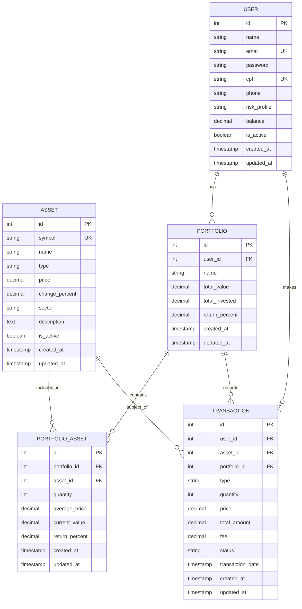

### Relacionamentos e Constraints

| Relacionamento | Tipo | Descrição |
|----------------|------|-----------|
| User → Portfolio | 1:N | Usuário pode ter múltiplos portfólios |
| User → Transaction | 1:N | Usuário realiza múltiplas transações |
| Portfolio → PortfolioAsset | 1:N | Portfólio contém múltiplos ativos |
| Portfolio → Transaction | 1:N | Transações afetam portfólio específico |
| Asset → PortfolioAsset | 1:N | Ativo pode estar em múltiplos portfólios |
| Asset → Transaction | 1:N | Ativo pode ter múltiplas transações |

---

## 🌐 API Architecture Overview

### Endpoints por Categoria

```mermaid
graph LR
    subgraph "Sistema Endpoints"
        HEALTH[❤️ /health<br/>Health Check<br/>System Status]
        DOCS[📚 /api-docs<br/>Swagger UI<br/>API Documentation]
        ROOT[🏠 /<br/>Homepage<br/>Landing Page]
    end
    
    subgraph "Autenticação Endpoints"
        LOGIN[🔐 POST /api/v1/auth/login<br/>User Authentication<br/>JWT Token Generation]
        REGISTER[📝 POST /api/v1/auth/register<br/>User Registration<br/>Account Creation]
        LOGOUT[🚪 POST /api/v1/auth/logout<br/>User Logout<br/>Token Invalidation]
        ME[👤 GET /api/v1/auth/me<br/>Current User<br/>Profile Information]
        VERIFY[✅ GET /api/v1/auth/verify<br/>Token Verification<br/>Authentication Check]
    end
    
    subgraph "Usuário Endpoints"
        USER_PROFILE[👤 GET /api/v1/users/profile<br/>User Profile<br/>Personal Information]
        UPDATE_PROFILE[✏️ PUT /api/v1/users/profile<br/>Update Profile<br/>Edit Information]
        CHANGE_PASSWORD[🔑 PUT /api/v1/auth/change-password<br/>Change Password<br/>Security Update]
    end
    
    subgraph "Ativos Endpoints"
        LIST_ASSETS[📊 GET /api/v1/assets<br/>List Assets<br/>Investment Catalog]
        GET_ASSET[📈 GET /api/v1/assets/:id<br/>Asset Details<br/>Specific Information]
        ASSET_HISTORY[📊 GET /api/v1/assets/:id/history<br/>Price History<br/>Historical Data]
    end
    
    subgraph "Portfólio Endpoints"
        GET_PORTFOLIO[💼 GET /api/v1/portfolio<br/>Portfolio Summary<br/>Holdings Overview]
        PORTFOLIO_DETAILED[📊 GET /api/v1/portfolio/detailed<br/>Detailed Analysis<br/>Complete Information]
        PORTFOLIO_PERFORMANCE[📈 GET /api/v1/portfolio/performance<br/>Performance Metrics<br/>Returns Analysis]
    end
    
    subgraph "Transações Endpoints"
        LIST_TRANSACTIONS[💸 GET /api/v1/transactions<br/>Transaction History<br/>Complete List]
        CREATE_TRANSACTION[➕ POST /api/v1/transactions<br/>New Transaction<br/>Buy/Sell Order]
        BUY_ASSET[💰 POST /api/v1/transactions/buy<br/>Buy Asset<br/>Purchase Order]
        SELL_ASSET[💸 POST /api/v1/transactions/sell<br/>Sell Asset<br/>Sale Order]
        GET_TRANSACTION[📋 GET /api/v1/transactions/:id<br/>Transaction Details<br/>Specific Information]
    end
    
    subgraph "Páginas Frontend"
        PAGE_HOME[🏠 GET /<br/>Home Page<br/>Landing Interface]
        PAGE_LOGIN[🔐 GET /login<br/>Login Page<br/>Authentication Form]
        PAGE_REGISTER[📝 GET /register<br/>Register Page<br/>Signup Form]
        PAGE_DASHBOARD[📊 GET /dashboard<br/>Dashboard Page<br/>Main Interface]
        PAGE_ASSETS[💰 GET /assets<br/>Assets Page<br/>Investment Catalog]
        PAGE_PORTFOLIO[💼 GET /portfolio<br/>Portfolio Page<br/>Holdings Analysis]
        PAGE_TRANSACTIONS[💸 GET /transactions<br/>Transactions Page<br/>History Interface]
        PAGE_PROFILE[👤 GET /profile<br/>Profile Page<br/>User Settings]
    end
```

### API Response Patterns

```json
// Success Response
{
    "success": true,
    "data": { /* payload */ },
    "message": "Operation completed successfully",
    "meta": {
        "timestamp": "2024-01-01T00:00:00.000Z",
        "pagination": { /* if applicable */ }
    }
}

// Error Response
{
    "success": false,
    "error": {
        "code": "VALIDATION_ERROR",
        "message": "Invalid input data",
        "details": [ /* validation errors */ ]
    },
    "meta": {
        "timestamp": "2024-01-01T00:00:00.000Z"
    }
}
```

---

## 🚀 Deployment Diagram

### Ambiente de Desenvolvimento

```mermaid
graph TB
    subgraph "Docker Environment"
        subgraph "Application Container"
            NODE_APP[🚀 Node.js App<br/>Port: 3001<br/>Volume: ./src<br/>Environment: development]
        end
        
        subgraph "Database Container"
            POSTGRES_DB[🐘 PostgreSQL<br/>Port: 5432<br/>Volume: postgres_data<br/>Database: investment_db]
        end
        
        subgraph "Cache Container"
            REDIS_CACHE[🔴 Redis<br/>Port: 6379<br/>Volume: redis_data<br/>Memory: 256MB]
        end
        
        subgraph "Admin Container"
            ADMINER_UI[🔍 Adminer<br/>Port: 8080<br/>Web UI<br/>Database Admin]
        end
    end
    
    subgraph "Host Machine"
        LOCALHOST[💻 Developer Machine<br/>macOS/Linux/Windows<br/>Docker Desktop<br/>Code Editor]
        BROWSER_DEV[🌐 Browser<br/>http://localhost:3001<br/>Development Access]
    end
    
    subgraph "External Services"
        DOCKER_HUB[🐳 Docker Hub<br/>Base Images<br/>node:18-alpine<br/>postgres:15-alpine]
    end
    
    LOCALHOST --> NODE_APP
    NODE_APP --> POSTGRES_DB
    NODE_APP --> REDIS_CACHE
    ADMINER_UI --> POSTGRES_DB
    BROWSER_DEV --> NODE_APP
    BROWSER_DEV --> ADMINER_UI
    
    DOCKER_HUB -.-> NODE_APP
    DOCKER_HUB -.-> POSTGRES_DB
    DOCKER_HUB -.-> REDIS_CACHE
```

### Configuração Docker Compose

```yaml
# docker-compose.yml
version: '3.8'
services:
  app:
    build: .
    ports: ["3001:3001"]
    volumes: ["./src:/app/src"]
    environment:
      - NODE_ENV=development
      - DB_HOST=postgres
      - REDIS_URL=redis://redis:6379
    depends_on: [postgres, redis]
    
  postgres:
    image: postgres:15-alpine
    ports: ["5432:5432"]
    environment:
      POSTGRES_DB: investment_db
      POSTGRES_USER: postgres
      POSTGRES_PASSWORD: postgres
    volumes: ["postgres_data:/var/lib/postgresql/data"]
    
  redis:
    image: redis:7-alpine
    ports: ["6379:6379"]
    volumes: ["redis_data:/data"]
    
  adminer:
    image: adminer
    ports: ["8080:8080"]
    depends_on: [postgres]
```

---

## 🔒 Security Architecture

### Segurança em Camadas

```mermaid
graph TB
    subgraph "Client Security"
        HTTPS[🔒 HTTPS/TLS<br/>Encrypted Transport<br/>Certificate Validation<br/>Secure Communication]
        CSP[🛡️ Content Security Policy<br/>XSS Prevention<br/>Script Source Control<br/>Injection Protection]
        CORS[🌐 CORS Headers<br/>Cross-Origin Control<br/>Allowed Origins<br/>Request Filtering]
    end
    
    subgraph "Application Security"
        JWT_AUTH[🔑 JWT Authentication<br/>Token-based Auth<br/>Stateless Sessions<br/>Secure Claims]
        BCRYPT[🔐 Password Hashing<br/>bcrypt Algorithm<br/>Salt Rounds: 12<br/>Secure Storage]
        VALIDATION[✅ Input Validation<br/>express-validator<br/>SQL Injection Prevention<br/>Data Sanitization]
        RATE_LIMITING[⏱️ Rate Limiting<br/>Request Throttling<br/>DDoS Protection<br/>IP-based Limits]
    end
    
    subgraph "Database Security"
        DB_AUTH[🔐 Database Authentication<br/>Username/Password<br/>Connection Encryption<br/>SSL/TLS]
        TRANSACTIONS[💼 ACID Transactions<br/>Data Consistency<br/>Rollback Support<br/>Isolation Levels]
        ENCRYPTION[🔒 Data Encryption<br/>At-rest Encryption<br/>Sensitive Data Protection<br/>Key Management]
    end
    
    subgraph "Infrastructure Security"
        CONTAINER_SEC[🐳 Container Security<br/>Non-root Users<br/>Minimal Images<br/>Security Scanning]
        NETWORK_SEC[🌐 Network Security<br/>Internal Networks<br/>Port Restrictions<br/>Service Isolation]
        ENV_SEC[🔐 Environment Security<br/>Secret Management<br/>Environment Variables<br/>Secure Configuration]
    end
    
    HTTPS --> JWT_AUTH
    CSP --> VALIDATION
    CORS --> RATE_LIMITING
    JWT_AUTH --> DB_AUTH
    BCRYPT --> TRANSACTIONS
    VALIDATION --> ENCRYPTION
    RATE_LIMITING --> CONTAINER_SEC
    DB_AUTH --> NETWORK_SEC
    TRANSACTIONS --> ENV_SEC
```

### Fluxo de Autenticação Segura

```mermaid
sequenceDiagram
    participant C as Cliente
    participant A as App Frontend
    participant B as Backend API
    participant D as Database
    
    C->>+A: Credenciais de login
    A->>A: Validação client-side
    A->>+B: POST /api/v1/auth/login
    B->>B: Validação server-side
    B->>+D: Buscar usuário
    D-->>-B: Dados do usuário
    B->>B: Verificar senha (bcrypt)
    B->>B: Gerar JWT token
    B-->>-A: Token + dados do usuário
    A->>A: Armazenar token (localStorage)
    A->>A: Atualizar interface
    A-->>-C: Login realizado
    
    Note over A,B: Requisições subsequentes
    A->>+B: Request com Authorization header
    B->>B: Verificar JWT token
    B->>B: Decodificar payload
    B-->>-A: Response autorizada
```

---

## 📊 Performance & Monitoring

### Métricas e Monitoramento

```mermaid
graph TB
    subgraph "Frontend Performance"
        PAGE_LOAD[⚡ Page Load Time<br/>First Contentful Paint<br/>Time to Interactive<br/>Core Web Vitals]
        ASSET_OPT[🎨 Asset Optimization<br/>CSS/JS Minification<br/>Image Compression<br/>Lazy Loading]
        CACHE_STRATEGY[💾 Caching Strategy<br/>Browser Cache<br/>Static Assets<br/>CDN Ready]
    end
    
    subgraph "Backend Performance"
        API_RESPONSE[🚀 API Response Time<br/>Endpoint Performance<br/>Database Query Time<br/>Business Logic Speed]
        DB_PERFORMANCE[🗃️ Database Performance<br/>Query Optimization<br/>Index Usage<br/>Connection Pooling]
        MEMORY_USAGE[💾 Memory Usage<br/>Heap Monitoring<br/>Garbage Collection<br/>Memory Leaks]
    end
    
    subgraph "System Monitoring"
        HEALTH_CHECK[❤️ Health Checks<br/>Application Status<br/>Database Connectivity<br/>External Services]
        ERROR_TRACKING[❌ Error Tracking<br/>Exception Monitoring<br/>Error Rates<br/>Stack Traces]
        LOGGING[📝 Logging<br/>Request Logs<br/>Application Logs<br/>Audit Trails]
    end
    
    subgraph "Infrastructure Monitoring"
        RESOURCE_USAGE[📊 Resource Usage<br/>CPU/Memory/Disk<br/>Container Metrics<br/>Docker Stats]
        NETWORK_METRICS[🌐 Network Metrics<br/>Bandwidth Usage<br/>Connection Count<br/>Latency Monitoring]
        SECURITY_MONITORING[🔒 Security Monitoring<br/>Failed Login Attempts<br/>Rate Limit Hits<br/>Suspicious Activity]
    end
```

---

## 🧪 Testing Strategy

### Estratégia de Testes

```mermaid
graph TB
    subgraph "Frontend Testing"
        UNIT_FRONTEND[🧪 Unit Tests<br/>JavaScript Functions<br/>Utility Methods<br/>Component Logic]
        INTEGRATION_FRONTEND[🔗 Integration Tests<br/>API Communication<br/>Form Validation<br/>User Interactions]
        E2E_TESTS[🌐 End-to-End Tests<br/>User Workflows<br/>Complete Scenarios<br/>Browser Automation]
    end
    
    subgraph "Backend Testing"
        UNIT_BACKEND[🧪 Unit Tests<br/>Business Logic<br/>Model Methods<br/>Utility Functions]
        INTEGRATION_BACKEND[🔗 Integration Tests<br/>API Endpoints<br/>Database Operations<br/>Middleware Testing]
        LOAD_TESTS[⚡ Load Tests<br/>Performance Testing<br/>Stress Testing<br/>Scalability Testing]
    end
    
    subgraph "Database Testing"
        MIGRATION_TESTS[🗃️ Migration Tests<br/>Schema Changes<br/>Data Migration<br/>Rollback Testing]
        DATA_INTEGRITY[✅ Data Integrity<br/>Constraint Testing<br/>Relationship Validation<br/>Transaction Testing]
    end
    
    subgraph "Security Testing"
        AUTH_TESTS[🔐 Authentication Tests<br/>JWT Validation<br/>Permission Testing<br/>Access Control]
        VULNERABILITY_TESTS[🛡️ Vulnerability Tests<br/>SQL Injection<br/>XSS Protection<br/>CSRF Prevention]
    end
```

---

## 📈 Scalability & Future Architecture

### Evolução para Microserviços

```mermaid
graph TB
    subgraph "Current Monolith"
        CURRENT[🏦 Sistema Monolítico<br/>Frontend + Backend<br/>Single Deployment<br/>Shared Database]
    end
    
    subgraph "Future Microservices"
        FRONTEND_SPA[🎨 Frontend SPA<br/>React/Vue/Angular<br/>Separate Deployment<br/>API Communication]
        
        AUTH_SERVICE[🔐 Auth Service<br/>User Management<br/>JWT Generation<br/>Identity Provider]
        
        PORTFOLIO_SERVICE[💼 Portfolio Service<br/>Portfolio Management<br/>Asset Allocation<br/>Performance Calculation]
        
        TRANSACTION_SERVICE[💸 Transaction Service<br/>Trade Processing<br/>Order Management<br/>Settlement]
        
        NOTIFICATION_SERVICE[📧 Notification Service<br/>Email/SMS/Push<br/>Alert Management<br/>Communication Hub]
        
        MARKET_SERVICE[📊 Market Data Service<br/>Real-time Quotes<br/>Historical Data<br/>Market Analysis]
    end
    
    subgraph "Data Layer Evolution"
        USER_DB[(👤 User Database<br/>PostgreSQL<br/>Identity Data)]
        PORTFOLIO_DB[(💼 Portfolio Database<br/>PostgreSQL<br/>Portfolio Data)]
        TRANSACTION_DB[(💸 Transaction Database<br/>PostgreSQL<br/>Trading Data)]
        MARKET_DB[(📊 Market Database<br/>TimeSeries DB<br/>Market Data)]
        CACHE_LAYER[(🔴 Redis Cluster<br/>Distributed Cache<br/>Session Store)]
    end
    
    CURRENT -.->|"Migration Path"| FRONTEND_SPA
    CURRENT -.->|"Decomposition"| AUTH_SERVICE
    CURRENT -.->|"Service Extraction"| PORTFOLIO_SERVICE
    CURRENT -.->|"Business Logic Split"| TRANSACTION_SERVICE
    
    AUTH_SERVICE --> USER_DB
    PORTFOLIO_SERVICE --> PORTFOLIO_DB
    TRANSACTION_SERVICE --> TRANSACTION_DB
    MARKET_SERVICE --> MARKET_DB
    
    AUTH_SERVICE --> CACHE_LAYER
    PORTFOLIO_SERVICE --> CACHE_LAYER
    TRANSACTION_SERVICE --> CACHE_LAYER
```

---

## 📋 Sistema Completo - Resumo Executivo

### 🎯 Características Principais

| Aspecto | Detalhes |
|---------|----------|
| **Arquitetura** | Monólito completo com frontend e backend integrados |
| **Frontend** | EJS templates + Bootstrap + JavaScript ES6+ |
| **Backend** | Express.js + JWT + Sequelize ORM |
| **Database** | PostgreSQL com relacionamentos ACID |
| **Cache** | Redis para sessões e performance |
| **Security** | JWT auth + bcrypt + validation + rate limiting |
| **API** | RESTful com 19 endpoints documentados |
| **UI/UX** | 8 páginas responsivas com gráficos Chart.js |
| **DevOps** | Docker Compose para desenvolvimento |
| **Docs** | Swagger UI + documentação completa |

### 📊 Métricas do Sistema

- **Total de Código**: ~4.000 linhas
- **Páginas Frontend**: 8 páginas completas
- **Endpoints API**: 19 endpoints RESTful
- **Modelos de Dados**: 5 entidades relacionadas
- **Componentes JS**: 4 classes principais
- **Estilos CSS**: 263 linhas customizadas
- **Documentação**: 2.000+ linhas

### 🚀 Funcionalidades Implementadas

- ✅ **Homepage** com overview e call-to-action
- ✅ **Sistema de Login/Registro** com validação
- ✅ **Dashboard** com widgets e gráficos Chart.js
- ✅ **Catálogo de Ativos** com filtros e busca
- ✅ **Análise de Portfólio** com métricas avançadas
- ✅ **Transações** com histórico e nova transação
- ✅ **Perfil do Usuário** com configurações completas
- ✅ **API REST** documentada com Swagger
- ✅ **Autenticação JWT** integrada frontend/backend
- ✅ **Design Responsivo** mobile-friendly
- ✅ **Containerização** Docker para desenvolvimento

### 🔮 Roadmap Futuro

1. **PWA** - Progressive Web App com service workers
2. **Real-time** - WebSockets para dados em tempo real
3. **Microservices** - Decomposição gradual em serviços
4. **Testing** - Suite completa de testes automatizados
5. **CI/CD** - Pipeline de integração contínua
6. **Monitoring** - APM e observabilidade completa
7. **Mobile App** - Aplicativo nativo iOS/Android

O **Sistema de Investimentos** demonstra uma arquitetura sólida e completa, fornecendo uma base educacional robusta para conceitos de desenvolvimento full-stack moderno. 