# 🔄 Diagramas de Sequência - Sistema de Investimentos

## 📋 Visão Geral

Este documento apresenta os diagramas de sequência dos principais fluxos do **Sistema de Investimentos**, demonstrando a interação entre frontend, backend e banco de dados em uma aplicação monolítica completa.

---

## 1. 🌐 Fluxo de Interface Web - Acesso ao Sistema

### 1.1 Acesso à Página Inicial

```mermaid
sequenceDiagram
    participant U as Usuário
    participant B as Browser
    participant APP as Express App
    participant AUTH as Auth Middleware
    participant V as Views (EJS)

    U->>+B: Acessa http://localhost:3001/
    B->>+APP: GET /
    
    APP->>+AUTH: optionalAuth middleware
    AUTH->>AUTH: Verificar token JWT (opcional)
    
    alt Token válido
        AUTH->>AUTH: Decodificar usuário
        AUTH-->>-APP: req.user = user
    else Sem token ou inválido
        AUTH-->>-APP: req.user = null
    end
    
    APP->>+V: Renderizar home.ejs
    V->>V: Compilar template com dados
    V-->>-APP: HTML compilado
    
    APP-->>-B: 200 OK + HTML
    B->>B: Carregar CSS/JS
    B->>B: Executar JavaScript
    B-->>-U: Página inicial exibida
```

### 1.2 Login via Interface Web

```mermaid
sequenceDiagram
    participant U as Usuário
    participant B as Browser
    participant APP as Express App
    participant API as API Routes
    participant AUTH as Auth Service
    participant DB as PostgreSQL

    U->>+B: Acessa /login
    B->>+APP: GET /login
    APP->>APP: Renderizar login.ejs
    APP-->>-B: Página de login
    B-->>-U: Formulário de login

    U->>+B: Preenche credenciais + Submit
    B->>B: Validação client-side
    B->>+APP: POST /api/v1/auth/login (AJAX)
    
    APP->>+API: Processar login
    API->>+AUTH: Validar credenciais
    AUTH->>+DB: SELECT * FROM users WHERE email = ?
    DB-->>-AUTH: Dados do usuário
    AUTH->>AUTH: Verificar senha (bcrypt)
    AUTH->>AUTH: Gerar JWT token
    AUTH-->>-API: { user, token }
    API-->>-APP: 200 OK + dados
    
    APP-->>-B: JSON response
    B->>B: Armazenar token (localStorage)
    B->>B: Atualizar interface
    B->>+APP: Redirect para /dashboard
    APP-->>-B: Dashboard HTML
    B-->>-U: Dashboard exibido
```



---

## 2. 📊 Fluxo de Dashboard - Carregamento de Dados

```mermaid
sequenceDiagram
    participant U as Usuário
    participant B as Browser
    participant APP as Express App
    participant AUTH as Auth Middleware
    participant API as API Routes
    participant P as Portfolio Model
    participant DB as PostgreSQL

    U->>+B: Acessa /dashboard
    B->>+APP: GET /dashboard
    
    APP->>+AUTH: requireAuth middleware
    AUTH->>AUTH: Verificar token JWT
    AUTH->>+DB: Buscar usuário por ID
    DB-->>-AUTH: Dados do usuário
    AUTH-->>-APP: req.user = user
    
    APP->>APP: Renderizar dashboard.ejs
    APP-->>-B: HTML + JavaScript
    B-->>-U: Dashboard skeleton

    Note over B: JavaScript executa carregamento assíncrono

    B->>+APP: GET /api/v1/portfolio (AJAX)
    APP->>+API: Buscar dados do portfólio
    API->>+P: Consultar posições
    P->>+DB: Query complexa com JOINs
    DB-->>-P: Dados do portfólio
    P-->>-API: Portfólio processado
    API-->>-APP: JSON com dados
    APP-->>-B: Dados do portfólio

    B->>B: Atualizar widgets
    B->>B: Renderizar gráficos (Chart.js)
    B->>B: Preencher tabelas
    B-->>U: Dashboard completo
```



---

## 3. 💰 Fluxo de Investimento - Interface Completa

### 3.1 Navegação para Catálogo de Ativos

```mermaid
sequenceDiagram
    participant U as Usuário
    participant B as Browser
    participant APP as Express App
    participant API as API Routes
    participant A as Asset Model
    participant DB as PostgreSQL

    U->>+B: Clica em "Ativos" no menu
    B->>+APP: GET /assets
    APP->>APP: Renderizar assets.ejs
    APP-->>-B: Página de ativos
    B-->>-U: Catálogo de ativos

    Note over B: JavaScript carrega dados dos ativos

    B->>+APP: Simular carregamento de ativos (mock data)
    APP-->>-B: Lista de ativos simulados
    B->>B: Renderizar tabela de ativos
    B->>B: Aplicar filtros e busca
    B-->>U: Lista de ativos interativa
```



### 3.2 Compra de Ativo via Modal

```mermaid
sequenceDiagram
    participant U as Usuário
    participant B as Browser
    participant APP as Express App
    participant API as API Routes
    participant T as Transaction Model
    participant P as Portfolio Model
    participant DB as PostgreSQL

    U->>+B: Clica "Investir" em um ativo
    B->>B: Abrir modal de investimento
    B->>B: Preencher dados do ativo
    B-->>-U: Modal de compra

    U->>+B: Preenche quantidade/preço + Confirma
    B->>B: Validação client-side
    B->>B: Calcular valor total
    B->>+APP: POST /api/v1/transactions/buy (AJAX)
    
    APP->>+API: Processar compra
    API->>+DB: BEGIN TRANSACTION
    
    API->>+T: Criar transação
    T->>+DB: INSERT INTO transactions
    DB-->>-T: Transação criada
    T-->>-API: Transaction ID
    
    API->>+P: Atualizar portfólio
    P->>+DB: UPDATE portfolio e portfolio_assets
    DB-->>-P: Portfólio atualizado
    P-->>-API: Sucesso
    
    API->>+DB: COMMIT TRANSACTION
    DB-->>-API: Transação confirmada
    API-->>-APP: Sucesso + dados
    
    APP-->>-B: 200 OK + dados da transação
    B->>B: Fechar modal
    B->>B: Mostrar notificação de sucesso
    B->>B: Atualizar saldo na interface
    B-->>-U: Feedback visual de sucesso
```



---

## 4. 📈 Fluxo de Portfólio - Visualização Interativa

```mermaid
sequenceDiagram
    participant U as Usuário
    participant B as Browser
    participant APP as Express App
    participant API as API Routes
    participant P as Portfolio Model
    participant PA as PortfolioAsset Model
    participant DB as PostgreSQL

    U->>+B: Navega para /portfolio
    B->>+APP: GET /portfolio
    APP->>APP: Renderizar portfolio.ejs
    APP-->>-B: Página do portfólio
    B-->>-U: Interface do portfólio

    Note over B: JavaScript inicializa gráficos

    B->>+APP: GET /api/v1/portfolio/detailed (AJAX)
    APP->>+API: Buscar dados detalhados
    
    API->>+P: Buscar portfólio
    P->>+DB: SELECT portfolio com relacionamentos
    DB-->>-P: Dados do portfólio
    P-->>-API: Portfolio data
    
    API->>+PA: Buscar posições detalhadas
    PA->>+DB: SELECT com JOINs para assets
    DB-->>-PA: Posições com dados dos ativos
    PA-->>-API: Posições detalhadas
    
    API->>API: Calcular métricas (performance, diversificação)
    API-->>-APP: Dados completos
    APP-->>-B: JSON com métricas

    B->>B: Renderizar gráfico de performance (Chart.js)
    B->>B: Renderizar gráfico de alocação
    B->>B: Preencher tabela de posições
    B->>B: Atualizar widgets de resumo
    B-->>U: Portfólio interativo completo

    Note over U,B: Usuário pode interagir com filtros e gráficos

    U->>+B: Altera filtro de timeframe
    B->>B: Atualizar dados do gráfico
    B->>B: Re-renderizar gráfico
    B-->>-U: Gráfico atualizado
```



---

## 5. 📊 Fluxo de Transações - Histórico e Nova Transação

### 5.1 Visualização do Histórico

```mermaid
sequenceDiagram
    participant U as Usuário
    participant B as Browser
    participant APP as Express App
    participant API as API Routes
    participant T as Transaction Model
    participant DB as PostgreSQL

    U->>+B: Acessa /transactions
    B->>+APP: GET /transactions
    APP->>APP: Renderizar transactions.ejs
    APP-->>-B: Página de transações
    B-->>-U: Interface de transações

    Note over B: JavaScript carrega dados simulados

    B->>B: Carregar dados mock de transações
    B->>B: Renderizar tabela com paginação
    B->>B: Aplicar filtros (data, tipo, ativo)
    B-->>U: Histórico de transações

    U->>+B: Aplica filtro por data
    B->>B: Filtrar dados localmente
    B->>B: Re-renderizar tabela
    B->>B: Atualizar contador
    B-->>-U: Transações filtradas
```



### 5.2 Criação de Nova Transação

```mermaid
sequenceDiagram
    participant U as Usuário
    participant B as Browser
    participant APP as Express App
    participant API as API Routes
    participant V as Validator
    participant T as Transaction Model
    participant DB as PostgreSQL

    U->>+B: Clica "Nova Transação"
    B->>B: Abrir modal de transação
    B->>B: Preencher data/hora atual
    B-->>-U: Modal de transação

    U->>+B: Preenche dados + Confirma
    B->>B: Validação client-side
    B->>B: Calcular totais
    B->>+APP: POST /api/v1/transactions (AJAX)
    
    APP->>+API: Processar nova transação
    API->>+V: Validar dados de entrada
    V-->>-API: Dados válidos
    
    API->>+DB: BEGIN TRANSACTION
    
    API->>+T: Criar transação
    T->>+DB: INSERT INTO transactions
    DB-->>-T: Transação criada
    T-->>-API: Nova transação
    
    API->>+DB: COMMIT TRANSACTION
    DB-->>-API: Sucesso
    API-->>-APP: Transação criada
    
    APP-->>-B: 201 Created + dados
    B->>B: Fechar modal
    B->>B: Limpar formulário
    B->>B: Adicionar à tabela local
    B->>B: Mostrar notificação
    B-->>-U: Transação adicionada
```



---

## 6. 👤 Fluxo de Perfil - Configurações do Usuário

```mermaid
sequenceDiagram
    participant U as Usuário
    participant B as Browser
    participant APP as Express App
    participant API as API Routes
    participant UM as User Model
    participant DB as PostgreSQL

    U->>+B: Acessa /profile
    B->>+APP: GET /profile
    APP->>APP: Renderizar profile.ejs
    APP-->>-B: Página de perfil
    B-->>-U: Interface de perfil com abas

    Note over B: JavaScript gerencia abas e formulários

    U->>+B: Altera dados pessoais + Salva
    B->>B: Validação client-side
    B->>+APP: PUT /api/v1/users/profile (AJAX)
    
    APP->>+API: Atualizar perfil
    API->>+UM: Atualizar dados
    UM->>+DB: UPDATE users SET ...
    DB-->>-UM: Usuário atualizado
    UM-->>-API: Sucesso
    API-->>-APP: Dados atualizados
    
    APP-->>-B: 200 OK
    B->>B: Mostrar notificação de sucesso
    B-->>-U: Perfil atualizado

    U->>+B: Altera senha na aba Segurança
    B->>B: Validar senhas coincidem
    B->>+APP: PUT /api/v1/auth/change-password (AJAX)
    
    APP->>+API: Alterar senha
    API->>API: Verificar senha atual
    API->>API: Hash nova senha (bcrypt)
    API->>+UM: Atualizar senha
    UM->>+DB: UPDATE users SET password = ?
    DB-->>-UM: Senha atualizada
    UM-->>-API: Sucesso
    API-->>-APP: Senha alterada
    
    APP-->>-B: 200 OK
    B->>B: Limpar formulário
    B->>B: Mostrar notificação
    B-->>-U: Senha alterada com sucesso
```



---

## 7. 🔐 Fluxo de Autenticação Integrada

### 7.1 Verificação Automática de Token

```mermaid
sequenceDiagram
    participant B as Browser
    participant JS as JavaScript App
    participant APP as Express App
    participant API as API Routes
    participant AUTH as Auth Service

    Note over B,JS: A cada carregamento de página

    B->>+JS: Document ready
    JS->>JS: Verificar token no localStorage
    
    alt Token existe
        JS->>+APP: GET /api/v1/auth/verify (AJAX)
        APP->>+API: Verificar token
        API->>+AUTH: Validar JWT
        AUTH-->>-API: Token válido/inválido
        
        alt Token válido
            API-->>-APP: Usuário autenticado
            APP-->>-JS: 200 OK + user data
            JS->>JS: Atualizar interface (mostrar nav logado)
            JS->>JS: Habilitar funcionalidades autenticadas
        else Token inválido
            API-->>-APP: Token inválido
            APP-->>-JS: 401 Unauthorized
            JS->>JS: Remover token do localStorage
            JS->>JS: Atualizar interface (mostrar nav público)
        end
    else Sem token
        JS->>JS: Mostrar interface pública
        JS->>JS: Desabilitar funcionalidades autenticadas
    end
    
    JS-->>-B: Interface atualizada
```

### 7.2 Logout Automático

```mermaid
sequenceDiagram
    participant U as Usuário
    participant B as Browser
    participant JS as JavaScript App
    participant APP as Express App

    U->>+B: Clica "Logout"
    B->>+JS: Evento de logout
    
    JS->>+APP: POST /api/v1/auth/logout (AJAX)
    APP-->>-JS: 200 OK (logout confirmado)
    
    JS->>JS: Remover token do localStorage
    JS->>JS: Limpar dados do usuário
    JS->>JS: Atualizar interface
    JS->>+APP: Redirect para /
    APP-->>-JS: Página inicial
    JS-->>-B: Interface pública
    B-->>-U: Usuário deslogado
```



---

## 8. 📱 Responsividade e UX

### 8.1 Carregamento Progressivo

```mermaid
sequenceDiagram
    participant U as Usuário
    participant B as Browser
    participant APP as Express App

    U->>+B: Acessa qualquer página
    B->>+APP: GET /page
    APP-->>-B: HTML básico + skeleton
    B-->>U: Página com loading state

    Note over B: Assets carregam em paralelo

    par Carregamento de CSS
        B->>APP: GET /css/app.css
        APP-->>B: CSS compilado
    and Carregamento de JS
        B->>APP: GET /js/app.js
        APP-->>B: JavaScript da aplicação
    and Carregamento de dados
        B->>APP: GET /api/v1/data (AJAX)
        APP-->>B: Dados JSON
    end

    B->>B: Aplicar estilos
    B->>B: Executar JavaScript
    B->>B: Renderizar dados
    B->>B: Remover skeleton
    B-->>U: Página completa carregada
```



---

## 🎯 Benefícios da Arquitetura Monolítica Integrada

### ✅ Vantagens Demonstradas

1. **Desenvolvimento Simplificado**: Um único codebase para frontend e backend
2. **Deploys Atômicos**: Frontend e backend sempre sincronizados
3. **Compartilhamento de Código**: Validações e utilitários reutilizados
4. **Performance**: Menos latência entre camadas
5. **Debugging Facilitado**: Stack trace completo em um só lugar
6. **SSR Built-in**: Server-side rendering nativo com EJS

### 🔄 Fluxos Otimizados

- **Cache de Templates**: EJS compila templates uma vez
- **Assets Estáticos**: Servidos diretamente pelo Express
- **Autenticação Unificada**: JWT funciona tanto na API quanto nas páginas
- **Error Handling**: Tratamento centralizado de erros frontend/backend

Estes diagramas demonstram a robustez e a segurança do sistema, essenciais para uma aplicação financeira educacional completa. 